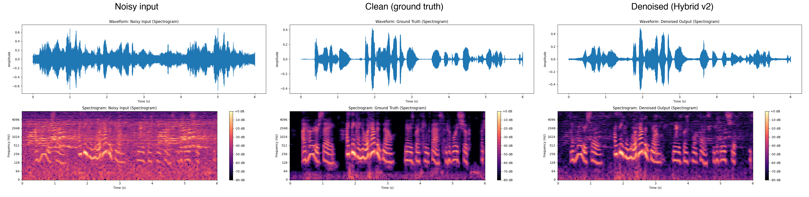
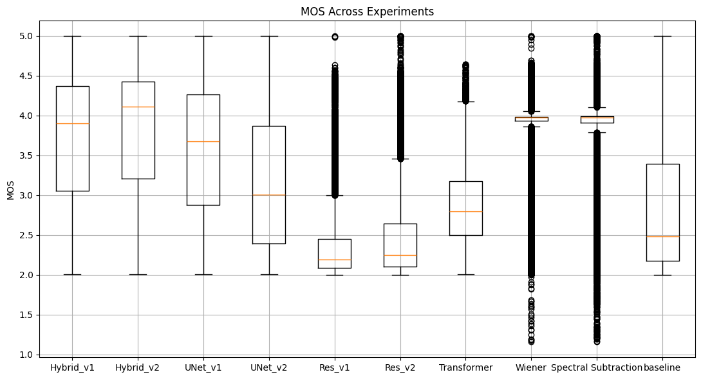

# Speech Denoising: Classical DSP vs Deep Learning


Comparative study of denoising techniques for speech in environmental
noise: spectral subtraction and Wiener filtering on the classical side;
residual, U-Net, Transformer and hybrid autoencoders on the deep learning
side. Evaluated on a synthetic dataset (clean speech from LibriSpeech,
noise from UrbanSound8K) with PESQ, STOI, SI-SDR and predicted MOS. The
best model — a hybrid autoencoder trained with a combined time/frequency
loss — reaches 11.69 dB SI-SDR and 0.89 STOI against a 0.10 dB / 0.74
baseline.

Final project for the **Physical Sensors and Systems for Environmental
Signals** course, MSc in Artificial Intelligence (University of
Milano-Bicocca).

<p align="center"></p>
<p align="center"><em>Hybrid v2 on a validation sample: noisy input, ground
truth, denoised output. Panels from the report, Fig. 4.</em></p>

## Results

Mean ± std on the validation set (report, Table 1):

| Method | PESQ | STOI | SI-SDR (dB) | MOS |
|---|---|---|---|---|
| Baseline (no denoising) | 1.16 | 0.74 | 0.10 | 2.84 |
| Spectral subtraction | 1.25 | 0.80 | 3.76 | 3.83 |
| Wiener filtering | 1.33 | 0.76 | −0.10 | 3.82 |
| U-Net (v1, time loss) | 1.35 | 0.78 | 3.95 | 3.54 |
| Transformer | 1.78 | 0.88 | 11.65 | 2.87 |
| **Hybrid v2 (time+frequency loss)** | **1.81** | **0.89** | **11.69** | **3.79** |

Every method improves on the baseline; the hybrid time/frequency loss is
what separates the top performers. Interestingly, for U-Net the simpler
time-domain loss (v1) beats the combined loss (v2) — the optimal loss
appears to be architecture-dependent (report, Section 6).

## Approach

- **Dataset**: synthetic mixtures of LibriSpeech clean speech and
  UrbanSound8K environmental noise.
- **Classical**: spectral subtraction, Wiener filtering.
- **Deep learning**: residual autoencoder, U-Net on spectrograms
  (Griffin-Lim phase reconstruction, 32 iterations), Transformer
  autoencoder, and a hybrid model combining time- and frequency-domain
  information.
- **Custom hybrid loss** weighting time-domain, frequency-domain and
  SI-SDR terms (`custom_loss.py`).
- **Evaluation**: reference implementations of PESQ/STOI/SI-SDR (the
  `torchaudio-squim` neural approximations were tested and discarded —
  their correlation with reference metrics was too loose, report Fig. 2)
  plus MOS predicted by torchaudio-squim's subjective model.

<p align="center"></p>
<p align="center"><em>Predicted MOS across all experiments. Source: report,
Fig. 3d.</em></p>

## How to run

```sh
pip install torch torchaudio librosa pesq pystoi matplotlib jupyter
jupyter lab Final_Project/main.ipynb          # training + experiments
jupyter lab Final_Project/research_evaluation.ipynb  # metrics + figures
```

Models are defined in `Final_Project/models.py`, the hybrid loss in
`Final_Project/custom_loss.py`, dataset synthesis in
`Final_Project/custom_datasets.py`.

## Report

Full write-up: [Final_Project_Signals_Mirko_Morello.pdf](Final_Project/Final_Project_Signals_Mirko_Morello.pdf)
(slides: [slides_signal.pdf](Final_Project/slides_signal.pdf)) — Mirko
Morello.
